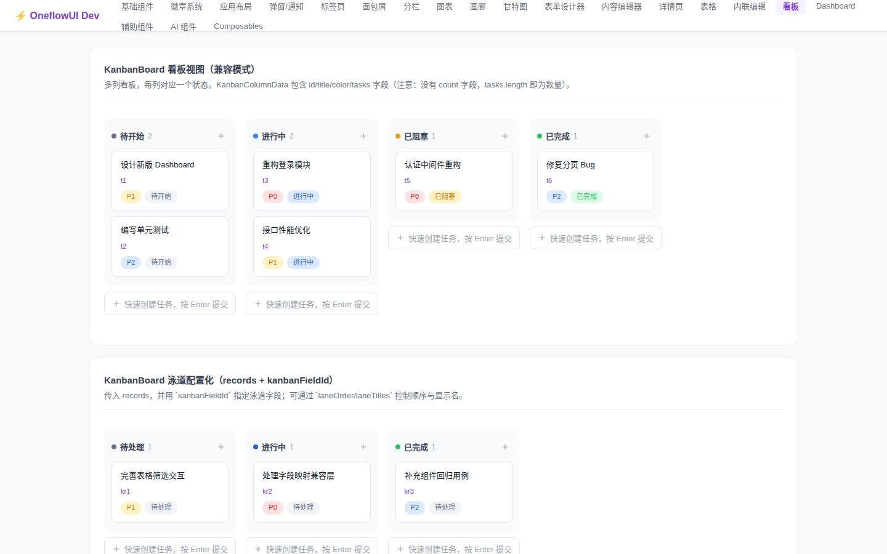
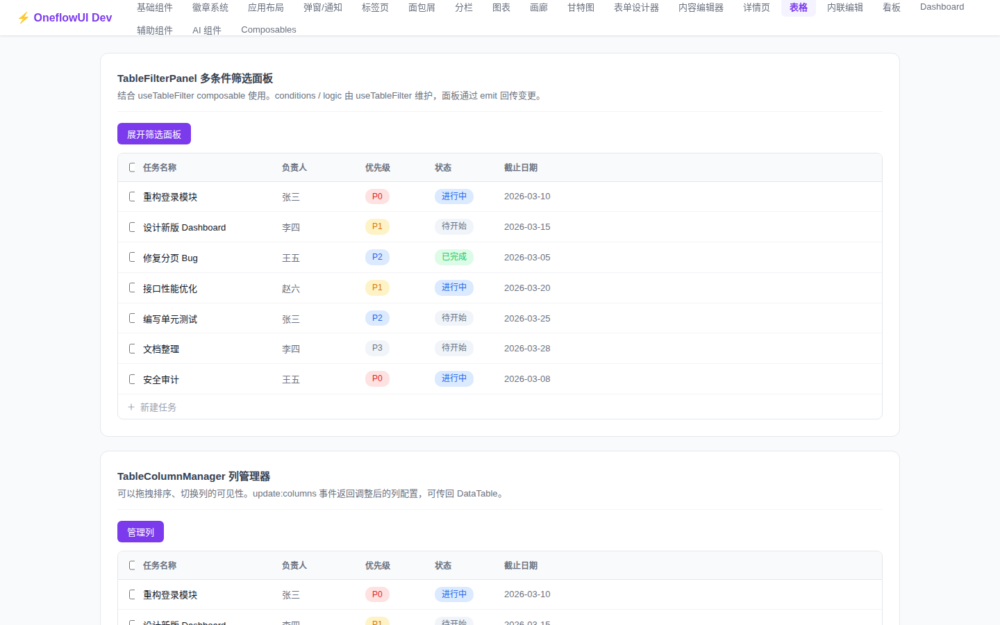
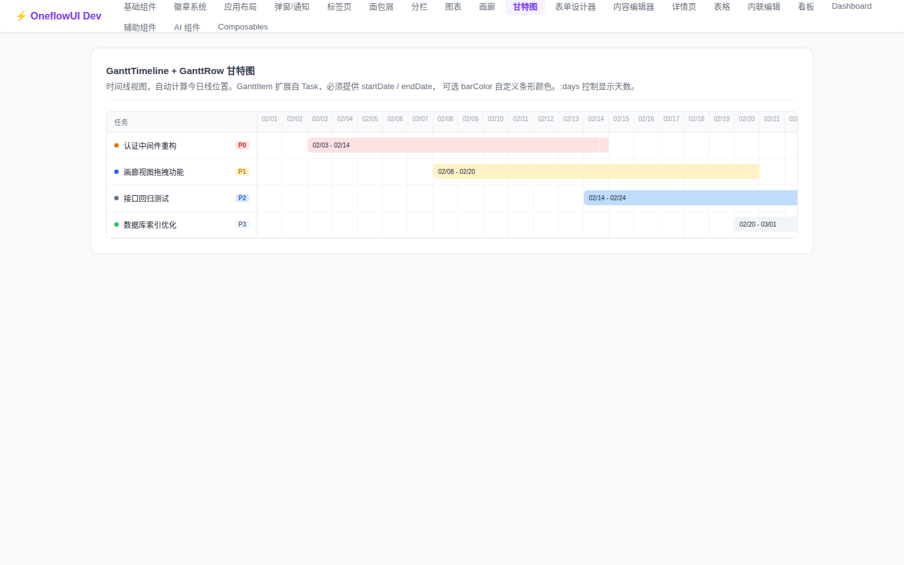
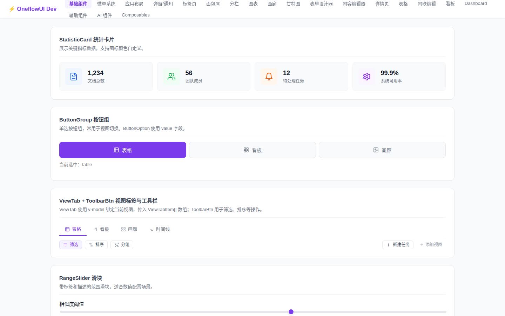
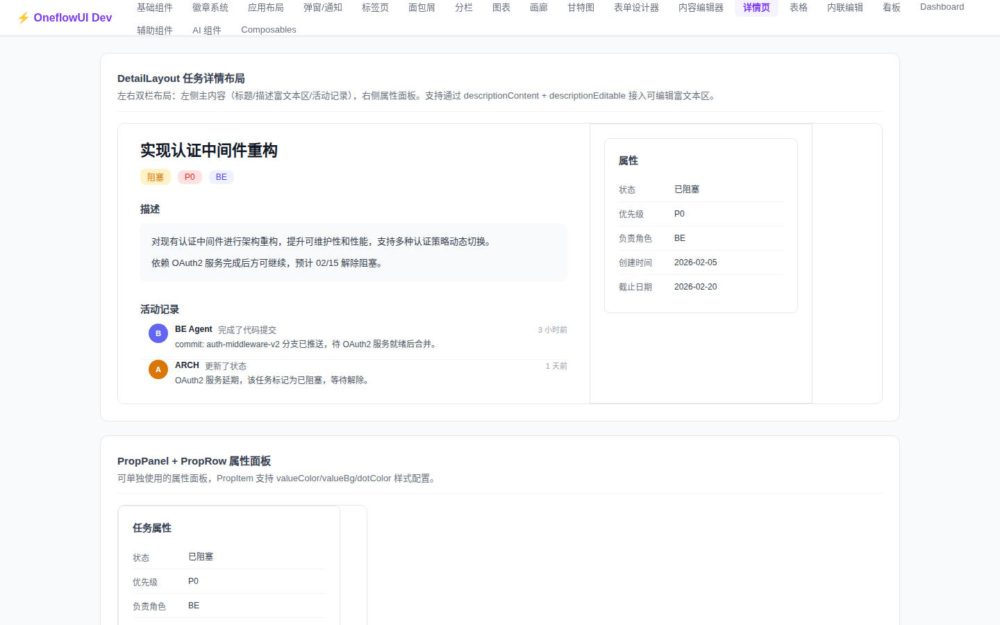
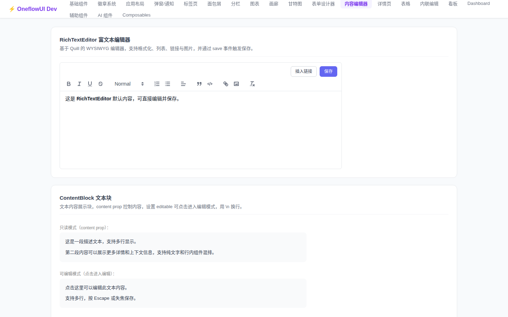
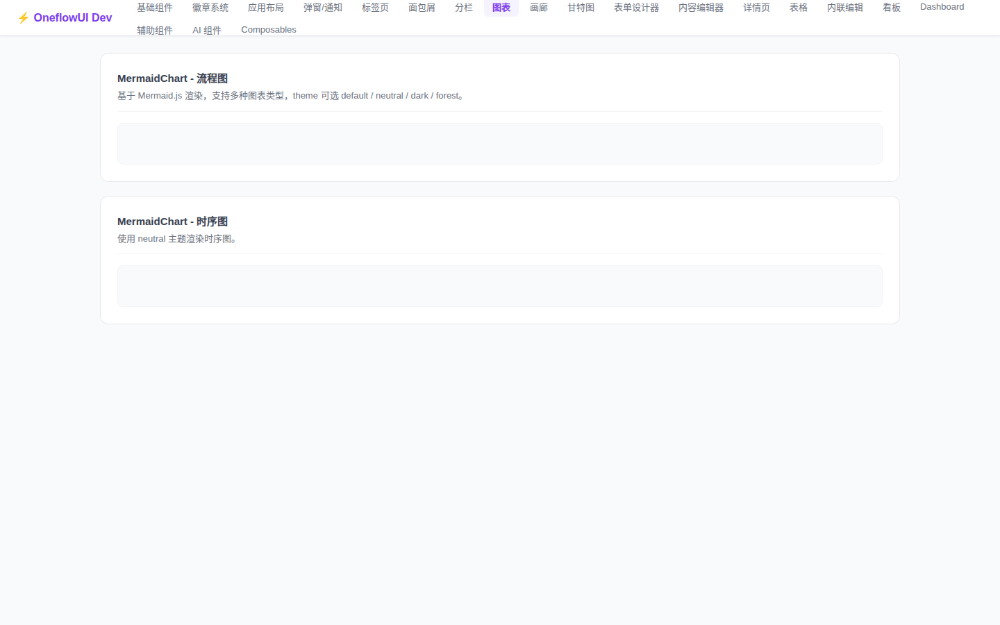

# OneFlow UI

[](https://www.npmjs.com/package/@oneflowui/ui)
[](https://www.npmjs.com/package/@oneflowui/ui)
[](https://github.com/qixi54/oneui/blob/main/LICENSE)

A **Vue 3 + TypeScript** component library for building task management and productivity applications. Ships **75+ ready-to-use components** covering views, AI chat, dashboards, editors, and more.

> [中文文档](./README.md)

---

## Components at a Glance

| Category | Components |
|----------|-----------|
| **Views** | DataTable, KanbanBoard, GalleryView, GanttTimeline |
| **AI Chat** | AiMessageList, AiMessageBubble, AiSender, AiThinking, AiStreamingCursor |
| **Dashboard** | Dashboard, BarChart, PieChart, DoughnutChart, NumberCard |
| **Editors** | RichTextEditor, CodeBlock, ContentBlock |
| **Detail** | DetailLayout, PropPanel, CommentItem |
| **Forms** | FormDesigner, 10 field components |
| **Layout** | AppLayout, Sidebar, Navbar, SplitPane |
| **General** | Modal, Dialog, Toast, Tabs, Breadcrumb, MermaidChart, ContextMenu |

---

## Preview

<table>
  <tr>
    <td align="center"><b>Kanban Board</b></td>
    <td align="center"><b>Data Table</b></td>
  </tr>
  <tr>
    <td></td>
    <td></td>
  </tr>
  <tr>
    <td align="center"><b>Gantt Timeline</b></td>
    <td align="center"><b>Dashboard</b></td>
  </tr>
  <tr>
    <td></td>
    <td></td>
  </tr>
  <tr>
    <td align="center"><b>AI Chat</b></td>
    <td align="center"><b>Detail Layout</b></td>
  </tr>
  <tr>
    <td></td>
    <td></td>
  </tr>
  <tr>
    <td align="center"><b>Rich Text Editor</b></td>
    <td align="center"><b>Mermaid Chart</b></td>
  </tr>
  <tr>
    <td></td>
    <td></td>
  </tr>
</table>

---

## Installation

```bash
# pnpm (recommended)
pnpm add @oneflowui/ui

# npm
npm install @oneflowui/ui

# yarn
yarn add @oneflowui/ui
```

Install peer dependencies as needed:

```bash
pnpm add vue
pnpm add mermaid   # required only when using MermaidChart
```

---

## Quick Start

### Register globally

```ts
import { createApp } from 'vue'
import App from './App.vue'
import OneflowUI from '@oneflowui/ui'
import '@oneflowui/ui/styles'

const app = createApp(App)
app.use(OneflowUI)
app.mount('#app')
```

### Import on demand

```ts
import { KanbanBoard, DataTable, AiMessageList, MermaidChart } from '@oneflowui/ui'
import '@oneflowui/ui/styles'
```

---

## Usage Examples

### KanbanBoard

```vue
<KanbanBoard
  :records="records"
  kanban-field-id="stage"
  :lane-order="['todo', 'doing', 'done']"
  :lane-titles="{ todo: 'Todo', doing: 'In Progress', done: 'Done' }"
/>
```

### AI Chat Panel

```vue
<script setup>
import { AiMessageList, AiSender, useAiChat } from '@oneflowui/ui'

const { messages, isThinking, send } = useAiChat({
  onRequest: async (content) => {
    // Connect your AI service here
  }
})
</script>

<template>
  <AiMessageList :messages="messages" :is-thinking="isThinking" />
  <AiSender @send="send" />
</template>
```

### GanttTimeline

```vue
<GanttTimeline
  :items="ganttItems"
  start-date="2026-01-01"
  end-date="2026-12-31"
  @item-click="onItemClick"
/>
```

### MermaidChart

```vue
<MermaidChart :code="`graph TD\n  A --> B\n  B --> C`" />
```

### DataTable

```vue
<DataTable
  :columns="[
    { key: 'title', label: 'Title', width: 'fill' },
    { key: 'status', label: 'Status', width: 120 },
    { key: 'priority', label: 'Priority', width: 100 },
  ]"
  :rows="tasks"
  @row-click="onRowClick"
/>
```

### Toast Notifications

```ts
import { useToast } from '@oneflowui/ui'

const toast = useToast()
toast.success('Saved successfully')
toast.error('Operation failed')
```

---

## Local Development

```bash
# Clone the repository
git clone https://github.com/qixi54/oneui.git
cd oneui

# Install dependencies
pnpm install

# Start dev server (port 5174)
pnpm dev

# Type check
pnpm type-check

# Run tests
pnpm test

# Build
pnpm build
```

---

## License

MIT
