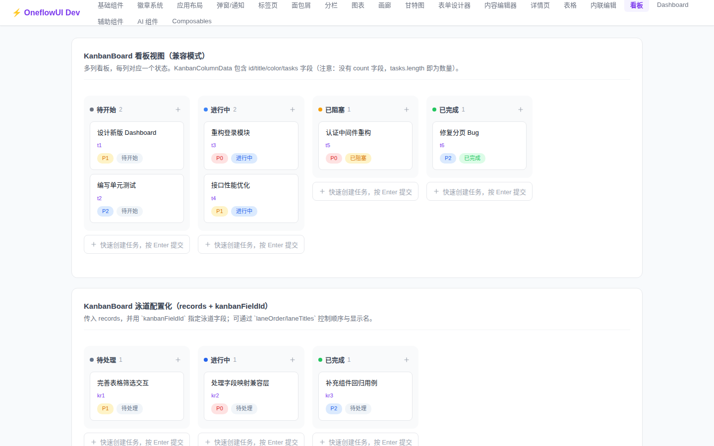
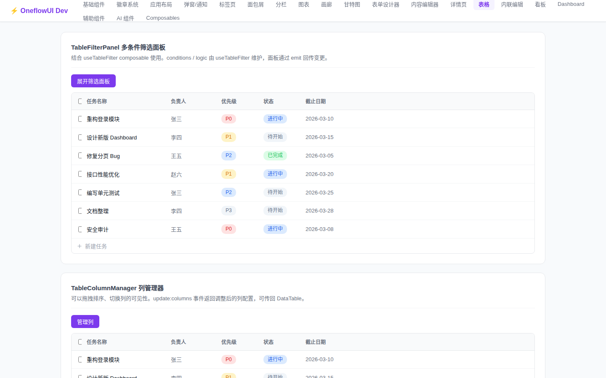
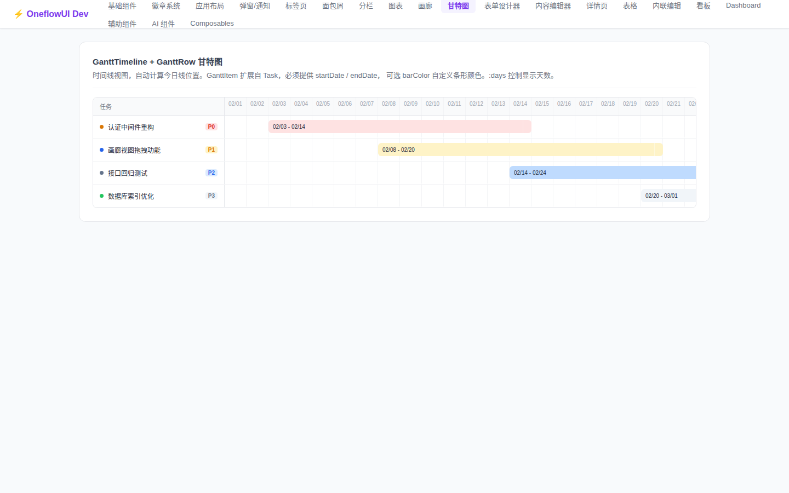
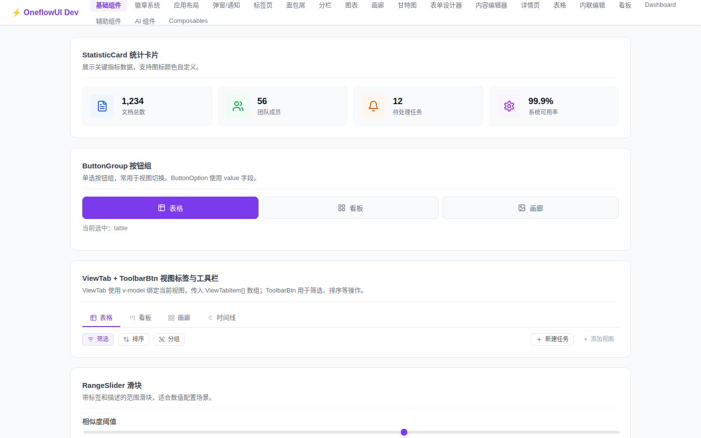
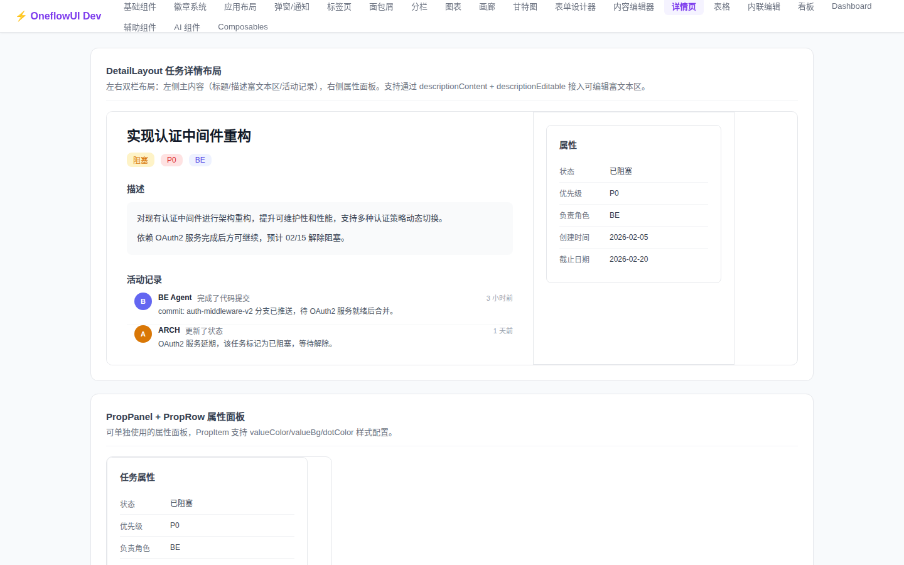
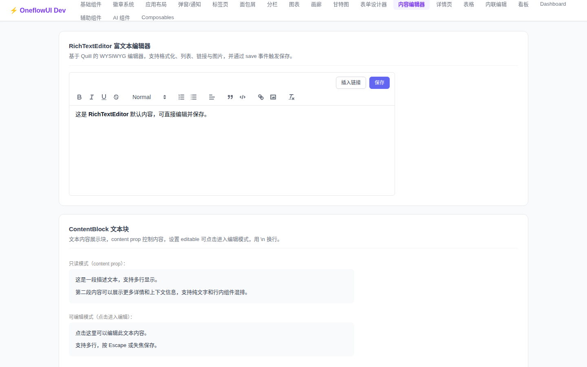
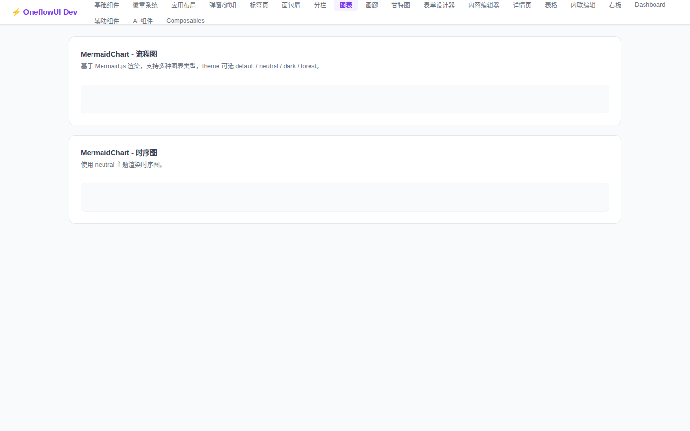

# OneFlow UI

> [English README](./README.en.md)

[](https://www.npmjs.com/package/@oneflowui/ui)
[](https://www.npmjs.com/package/@oneflowui/ui)
[](https://github.com/qixi54/oneui/blob/main/LICENSE)

Vue 3 + TypeScript 任务管理视图组件库，75 个组件开箱即用。

**包含**：Table、Kanban、Gantt 甘特图、Gallery、AI Chat、Dashboard 图表、Rich Text Editor、Form Designer、MermaidChart、Toast 等。

---

## 预览

<table>
  <tr>
    <td align="center"><b>Kanban 看板</b></td>
    <td align="center"><b>DataTable 数据表格</b></td>
  </tr>
  <tr>
    <td></td>
    <td></td>
  </tr>
  <tr>
    <td align="center"><b>Gantt 甘特图</b></td>
    <td align="center"><b>Dashboard 仪表盘</b></td>
  </tr>
  <tr>
    <td></td>
    <td></td>
  </tr>
  <tr>
    <td align="center"><b>AI Chat 对话组件</b></td>
    <td align="center"><b>DetailLayout 详情页</b></td>
  </tr>
  <tr>
    <td></td>
    <td></td>
  </tr>
  <tr>
    <td align="center"><b>RichTextEditor 富文本</b></td>
    <td align="center"><b>MermaidChart 图表</b></td>
  </tr>
  <tr>
    <td></td>
    <td></td>
  </tr>
</table>

---

## 安装

```bash
# pnpm（推荐）
pnpm add @oneflowui/ui

# npm
npm install @oneflowui/ui

# yarn
yarn add @oneflowui/ui
```

安装 peer dependencies（按需）：

```bash
pnpm add vue
pnpm add mermaid   # 使用 MermaidChart 时需要
```

---

## 快速开始

### 全局注册

```ts
import { createApp } from 'vue'
import App from './App.vue'
import OneflowUI from '@oneflowui/ui/plugin'
import '@oneflowui/ui/styles'

const app = createApp(App)
app.use(OneflowUI)
app.mount('#app')
```

如果需要更细粒度的导入边界，可以直接使用稳定子路径入口：

```ts
import { useVirtualListStateCache } from '@oneflowui/ui/composables'
import type { DataRecord } from '@oneflowui/ui/types'
```

推荐约定：
- 组件与公共能力优先从 `@oneflowui/ui` 根入口导入。
- composables 和纯类型如果希望导入意图更清晰，可分别从 `@oneflowui/ui/composables` 与 `@oneflowui/ui/types` 导入。
- 如果只想注入 token 和主题层，不想顺带注册插件，可改用 `@oneflowui/ui/theme`。
- 样式全量入口仍保留 `@oneflowui/ui/styles`，兼容现有消费方式。

### 按需引入

```ts
import { KanbanBoard, DataTable, AiMessageList, MermaidChart } from '@oneflowui/ui'
import '@oneflowui/ui/styles'
```

说明：从 `0.5.4` 开始，`plugin` 入口与根入口解耦。全局注册走 `@oneflowui/ui/plugin`，命名导入继续走 `@oneflowui/ui`。

### 主题层

OneUI 当前默认提供一套中性主题，并允许在不改组件逻辑的前提下切换到上层产品皮肤。

- 默认主题：`neutral`
- 可选皮肤：`ops-console`

推荐做法是让组件继续消费统一 token，然后由应用层切换主题，而不是直接覆盖组件内部样式。

```ts
import '@oneflowui/ui/styles'

document.documentElement.dataset.ofTheme = 'neutral'
// 或
document.documentElement.dataset.ofTheme = 'ops-console'
```

如果你希望把“样式注入”和“组件插件注册”拆开，推荐改用更明确的主题入口：

```ts
import '@oneflowui/ui/theme'
```

这套结构的目标是：

1. 组件默认保持中性、可复用
2. 业务系统通过主题皮肤注入品牌感或中控台气质
3. 后续可继续扩展更多主题，而不需要修改组件 API

### Token Override / Theme Bridge

如果你的应用已经有自己的设计系统 token，建议保留它们作为真源，再通过 CSS 变量桥接到 OneUI 的 `--of-*` 命名空间。运行时主题文件本身也遵循这个原则：`src/styles/variables.css` 负责默认 `--of-*` 变量面，`src/styles/themes/neutral.css` 和 `src/styles/themes/ops-console.css` 只覆盖语义层。

```css
:root {
  --app-surface-canvas: #f6f7f9;
  --app-surface-panel: #ffffff;
  --app-text-primary: #0f172a;
  --app-text-secondary: #526071;
  --app-border-subtle: rgba(15, 23, 42, 0.08);
  --app-accent-default: #334155;

  --of-surface-canvas: var(--app-surface-canvas);
  --of-surface-elevated: var(--app-surface-panel);
  --of-text-primary: var(--app-text-primary);
  --of-text-secondary: var(--app-text-secondary);
  --of-border-subtle: var(--app-border-subtle);
  --of-accent-default: var(--app-accent-default);
}
```

局部换肤时，优先把 bridge 绑到 wrapper 上，而不是改全局根节点：

```css
.ops-preview {
  --app-surface-canvas: #edf3f8;
  --app-surface-panel: rgba(255, 255, 255, 0.88);
  --app-accent-default: #0f4c81;

  --of-surface-canvas: var(--app-surface-canvas);
  --of-surface-elevated: var(--app-surface-panel);
  --of-accent-default: var(--app-accent-default);
}
```

完整 token 参考按 surface / text / border / accent / state / shadow / radius / spacing / z-index 分类收录在 [`docs/CSS-TOKENS.md`](docs/CSS-TOKENS.md)。

### ThemeScope 包装组件

如果同一页面里需要并存两种视觉语境，优先使用 `ThemeScope`。这个组件会自动给 wrapper 注入 `data-of-theme` 和 `data-of-theme-scope`，业务方不需要手写属性。

```vue
<script setup lang="ts">
import { DataTable, ThemeScope } from '@oneflowui/ui'
</script>

<template>
  <ThemeScope theme="ops-console" tag="section" class="ops-preview">
    <div class="ops-preview__panel">
      <h3>局部 ops-console 预览</h3>
      <p>这里会继承 ops-console 的 token，而外层仍然保持全局 neutral。</p>
    </div>
  </ThemeScope>
</template>
```

`ThemeScope` 当前支持的主题值与全局主题一致：

- `neutral`
- `ops-console`

老代码里直接手写的 `data-of-theme-scope` 仍然兼容，但新代码优先使用组件入口。

### ThemeScope 场景组件

如果你想把“局部主题 + 标题 + 说明 + meta/footer 插槽”一起复用，直接用 `ThemeScopeScene`。它是一个轻量的场景壳层组件，适合企业后台、运营控制台、任务中心这类页面。

```vue
<script setup lang="ts">
import { DataTable, ThemeScopeScene } from '@oneflowui/ui'
</script>

<template>
  <ThemeScopeScene
    theme="ops-console"
    tag="section"
    eyebrow="Enterprise Scene"
    title="任务总览"
    description="这个区域会自动获得 ops-console token。"
  >
    <template #meta>
      <span class="scene-chip">ThemeScopeScene</span>
    </template>

    <DataTable :rows="rows" :columns="columns" />

    <template #footer>
      <small>footer / notes / actions</small>
    </template>
  </ThemeScopeScene>
</template>
```

`ThemeScopeScene` 内部继续复用 `ThemeScope` 的 token 作用域，所以它仍然是 non-breaking 的增强，只是把常见业务壳层收成了一个可复用组件。

### 虚拟列表状态缓存

如果虚拟列表会频繁 remount，但你希望保留 `scrollTop`、`containerHeight` 和 `invalidateVersion`，可以按 key 复用同一份状态。
`createVirtualListState()` 仍然可用，而 `useVirtualListStateCache()` 适合把同一份状态挂在多个 remount 之间。

```ts
import { useVirtualList, useVirtualListStateCache } from '@oneflowui/ui'

const virtualListState = useVirtualListStateCache('ai-message-list')

const { visibleItems, totalHeight, offsetY } = useVirtualList({
  items: messages,
  itemHeight: 60,
  containerRef,
  state: virtualListState,
})
```

## 发布与验收

如果你需要核对当前可追溯的发布材料，优先看这几份文档：

- `0.9.8` 发布阻塞记录：[`docs/plans/2026-05-07-release-0.9.8-proof.md`](docs/plans/2026-05-07-release-0.9.8-proof.md)
- `0.9.8` 版本日志：[`docs/CHANGELOG-v0.9.8.md`](docs/CHANGELOG-v0.9.8.md)
- Overlay 修复计划：[`docs/plans/2026-03-30-oneui-issues-136-138-remediation-plan.md`](docs/plans/2026-03-30-oneui-issues-136-138-remediation-plan.md)
- 预发布验证：[`docs/plans/2026-03-22-oneui-theme-scope-middleware-composer-pre-release-verification.md`](docs/plans/2026-03-22-oneui-theme-scope-middleware-composer-pre-release-verification.md)
- 子路径入口治理：[`docs/plans/2026-03-22-oneui-package-entrypoints-verification.md`](docs/plans/2026-03-22-oneui-package-entrypoints-verification.md)

当前 npm 主站已发布版本仍为 `0.9.7`；仓库内下一版 `0.9.8` 的验证与 publish 阻塞信息统一收口在 `docs/plans/2026-05-07-release-0.9.8-proof.md`。

---

## 页面级方案

当前已经支持直接从包里接入页面级入口：

```ts
import { DatabaseView, useDatabaseView } from '@oneflowui/ui'
```

`DatabaseView` 负责统一页面容器，`useDatabaseView` 负责页面状态编排。`dev` app 也已经接入这条链路，
用于证明 `local/provider` 双模式、视图切换、selected record 与 detail workspace 可以在同一页面层里闭环。
当前页面级契约还把 `detailPresentation` 和 `density` 作为明确的对齐方向：桌面端优先右侧 workspace，
移动端保留 sheet fallback；页面密度则统一按 `compact / standard / comfortable` 三档表达。

如果业务页来自通知、看板卡片或列表钻取，建议把 `detail-source` 一并传给 `DatabaseView`，这样 detail slot
就能同时拿到 `source` 和 `presentation` 两个 deep-link hints，而不需要业务侧再重复拼装来源说明。

```vue
<DatabaseView
  table-id="issues"
  detail-source="notifications"
  detail-presentation="sheet"
>
  <template #actions="{ source, presentation }">
    <span>{{ source }} / {{ presentation }}</span>
  </template>
</DatabaseView>
```

```ts
const view = useDatabaseView({
  mode: 'provider',
  schemaSource,
  dataSource,
  actions: {
    onFetch,
    onRefresh,
    onUpdateRecord,
    onCreateRecord,
    onDeleteRecord,
    onSaveView,
    onSchemaChange,
  },
})
```

### 模式

- `local` 模式：外部直接传 `schema + records + view`，页面只负责筛选、排序、切视图和展示状态，不触发远程请求。
- `provider` 模式：外部传入数据获取/刷新能力，页面 shell 只消费 provider 返回的 `schema / records / views`，不绑定具体后端实现。

### actions 契约

页面级方案只回传动作，不在组件内部写死业务逻辑。常见契约如下：

```ts
type DatabaseViewActions = {
  onFetch?: (params: { viewId: string }) => Promise<void> | void
  onRefresh?: () => Promise<void> | void
  onUpdateRecord?: (payload: {
    tableId: string
    recordId: string
    patch: Record<string, unknown>
    record: DataRecord
  }) => Promise<void> | void
  onCreateRecord?: (payload: {
    tableId: string
    record: DataRecord
  }) => Promise<void> | void
  onDeleteRecord?: (payload: {
    tableId: string
    recordId: string
  }) => Promise<void> | void
  onSaveView?: (viewId: string, payload: Record<string, unknown>) => Promise<void> | void
  onSchemaChange?: (payload: Record<string, unknown>) => Promise<void> | void
}
```

如果接入的是 `provider` 模式，建议把 `onFetch` / `onRefresh` 作为必配项；如果接入的是 `local` 模式，则重点只需要保证 `onUpdateRecord`、`onCreateRecord`、`onDeleteRecord` 和 `onSaveView` 这几类页面动作可回传。

其中 `kanban` 视图会在以下场景自动回传这些动作：

- 拖拽卡片换列或排序后，按 `record.id` 回传 `onUpdateRecord`
- `QuickAddRow` 新建卡片后，回传 `onCreateRecord`
- 若上层把某些记录从列集合中移除，可回传 `onDeleteRecord`

### Middleware presets

如果页面想复用 toast、分析埋点或乐观更新逻辑，可以直接组合 `useDatabaseView` 提供的 middleware presets：

```ts
import {
  composeDatabaseViewMiddlewares,
  createDatabaseViewAnalyticsMiddleware,
  createDatabaseViewPresetBundle,
  createDatabaseViewPresetMiddleware,
  createDatabaseViewOptimisticMiddleware,
  createDatabaseViewToastMiddleware,
  useDatabaseView,
} from '@oneflowui/ui'

const middleware = composeDatabaseViewMiddlewares(
  createDatabaseViewToastMiddleware({
    onSuccess: (message) => toast.success(message),
    onError: (message) => toast.error(message),
  }),
  createDatabaseViewAnalyticsMiddleware({
    onEvent: (event) => console.log('[db-view]', event.phase, event.action),
  }),
  createDatabaseViewOptimisticMiddleware({
    apply: ({ payload }) => updateLocalRecord(payload),
    revert: ({ payload }) => revertLocalRecord(payload),
  }),
)

const view = useDatabaseView({
  tableId: 'tbl-1',
  actions: {
    middleware,
    onCellEdit: saveCellEdit,
  },
})
```

除 `cell-edit` 之外，middleware 现在也会覆盖：

- `create-record`
- `update-record`
- `delete-record`

因此看板里的 quick-add、拖拽换列和删卡这类持久化动作，也会进入同一套 toast / analytics / optimistic 链路。

如果你更想要一个“一键拿到可直接消费的 middleware”的入口，可以优先用官方 preset 工厂：

```ts
const presetBundle = createDatabaseViewPresetBundle({
  toast: {
    onSuccess: (message) => toast.success(message),
    onError: (message) => toast.error(message),
  },
  analytics: {
    onEvent: (event) => console.log('[db-view]', event.phase, event.action),
  },
  optimistic: {
    apply: ({ payload }) => updateLocalRecord(payload),
    revert: ({ payload }) => revertLocalRecord(payload),
  },
})

const view = useDatabaseView({
  tableId: 'tbl-1',
  actions: {
    middleware: presetBundle.middleware,
    onCellEdit: saveCellEdit,
  },
})
```

`createDatabaseViewPresetBundle` 会把常用 preset 先组装好，再暴露给业务方按需复用；`createDatabaseViewPresetMiddleware` 则适合直接塞进 `actions.middleware`，用于最小接入，例如：

```ts
const middleware = createDatabaseViewPresetMiddleware({
  toast: {
    onSuccess: (message) => toast.success(message),
    onError: (message) => toast.error(message),
  },
  analytics: {
    onEvent: (event) => console.log('[db-view]', event.phase, event.action),
  },
  optimistic: {
    apply: ({ payload }) => updateLocalRecord(payload),
    revert: ({ payload }) => revertLocalRecord(payload),
  },
})
```

### ThemeScope 场景模板

如果你想把 `ThemeScope` 从“局部 wrapper”升级成“业务场景模板”，可以直接把它当成页面壳层来组织区域结构。这个模板适合企业后台、运营控制台、任务看板这类页面：外层固定视觉语境，内层再放业务卡片、数据表、统计块和侧边说明。

```vue
<script setup lang="ts">
import { ThemeScope } from '@oneflowui/ui'
</script>

<template>
  <ThemeScope theme="ops-console" tag="section" class="enterprise-scene">
    <header class="enterprise-scene__header">
      <h3>Enterprise Scene</h3>
      <p>主题、布局和业务内容一起作为模板复用。</p>
    </header>

    <div class="enterprise-scene__body">
      <div class="enterprise-scene__summary">...</div>
      <DataTable :rows="rows" :columns="columns" />
    </div>
  </ThemeScope>
</template>
```

仓库里的 `src/dev/examples/database/DatabaseEnterpriseDemo.vue` 就是这一类场景组件的 dev/examples 级参考实现。它展示的是“ThemeScopeScene + DatabaseView + middleware”的组合方式，便于复制到自家项目里改造成真正的企业页。

### Dev Examples / Enterprise Demo

`src/dev/examples/database/DatabaseEnterpriseDemo.vue` 是 dev/examples 级的消费范式，用来展示更完整的企业版页面组合方式。它属于开发示例和文档参考，不是 npm 包对外导出的组件，不会改变 `@oneflowui/ui` 的公开导出面。
仓库同时提供 `src/dev/examples/database/DatabasePresetDemo.vue` 作为更短的 preset bundle 官方示例，重点展示 `createDatabaseViewPresetBundle` / `actions.middleware` 的直接消费方式。

如果你在业务工程里需要类似的页面，建议直接复制示例里的组合思路，再按自己的数据源和动作契约接入，而不是依赖一个额外的生产级导出入口。

### 组合消费示例

如果你要在同一块业务区域里同时使用主题作用域、数据库动作中间件和虚拟列表状态缓存，可以把三者放进同一个组件壳层。这个写法更接近真实业务页，也最适合作为复制模板。

```vue
<script setup lang="ts">
import { ref } from 'vue'
import {
  ThemeScope,
  composeDatabaseViewMiddlewares,
  createDatabaseViewAnalyticsMiddleware,
  createDatabaseViewOptimisticMiddleware,
  createDatabaseViewToastMiddleware,
  useDatabaseView,
  useVirtualList,
  useVirtualListStateCache,
} from '@oneflowui/ui'

const containerRef = ref<HTMLElement | null>(null)
const virtualListState = useVirtualListStateCache('task-feed')

const middleware = composeDatabaseViewMiddlewares(
  createDatabaseViewToastMiddleware({
    onSuccess: (message) => toast.success(message),
    onError: (message) => toast.error(message),
  }),
  createDatabaseViewAnalyticsMiddleware({
    onEvent: (event) => console.log('[db-view]', event.phase, event.action),
  }),
  createDatabaseViewOptimisticMiddleware({
    apply: ({ payload }) => updateLocalRecord(payload),
    revert: ({ payload }) => revertLocalRecord(payload),
  }),
)

const view = useDatabaseView({
  tableId: 'tbl-1',
  actions: {
    middleware,
    onCellEdit: saveCellEdit,
  },
})

const { visibleItems } = useVirtualList({
  items: view.records,
  itemHeight: 60,
  containerRef,
  state: virtualListState,
})

const columns = [
  { key: 'title', label: '任务', width: 'fill' },
  { key: 'status', label: '状态', width: 120 },
  { key: 'priority', label: '优先级', width: 100 },
]
</script>

<template>
  <ThemeScope theme="ops-console" tag="section" class="task-surface">
    <header class="task-surface__header">
      <h3>任务总览</h3>
      <p>外层是局部 ops-console token，内部动作、列表和状态缓存都复用同一套组件入口。</p>
    </header>

    <div ref="containerRef" class="task-surface__list">
      <DataTable :rows="visibleItems" :columns="columns" />
    </div>
  </ThemeScope>
</template>
```

这三个能力可以独立使用，也可以像上面这样组合使用；它们都是非 breaking 增强，不要求业务方修改现有组件 API。

### Selected record / detail workspace

当前 dev app 已经把“选中记录 -> detail workspace”这条链路接起来了：点击 table / kanban / gallery / timeline 中的条目，会把当前记录送入详情工作区，再由 `DetailLayout`、`PropPanel`、`CommentItem` 这组组件展示主内容、属性和活动记录。

这证明页面级方案已经具备“列表视图 + 选中态 + 详情工作区”的最小闭环，并且可以作为业务页面底座直接接入。
更完整的外部接入约定见 [`docs/DATABASE-VIEW-DETAIL-USAGE.md`](docs/DATABASE-VIEW-DETAIL-USAGE.md)。

### `detailPresentation` / `density`

页面级方案在语义上继续收敛两个关键契约：

- `detailPresentation`：用于描述详情工作区的呈现方式，默认思路是桌面端 `side-panel`、移动端 `sheet`。
- `density`：用于统一页面与表格的视觉密度语义，建议仅使用 `compact`、`standard`、`comfortable` 三档。

这两个契约的目标不是替换现有组件，而是让页面层把右侧工作区、行高密度和默认布局策略收成一致的入口语义。

### 已支持 / 暂未支持

| 已支持 | 暂未支持 |
|---|---|
| `local/provider` 两种模式的页面壳层接入 | 真实 provider 数据闭环、权限与持久化策略 |
| `normal / loading / empty / error` 四态透传 | 写操作的最终落库与回滚编排 |
| `table / kanban / gallery / timeline` 多视图切换 | 可编辑 detail workspace 的最终保存、ACL、schema 管理后台 |
| `search / filter / sort / group / save-view / load-view` 工具栏契约 | 远程视图保存、跨端同步与更重的页面编排 |
| `schema + records + viewConfig` 数据驱动 | 业务应用侧自定义的 provider 适配层 |
| `selected record -> detail workspace` 页面链路 | detail 编辑后的最终提交、乐观更新、冲突处理 |

---

## 组件一览

| 分类 | 组件 |
|------|------|
| **视图** | DataTable, KanbanBoard, GalleryView, GanttTimeline |
| **AI 对话** | AiMessageList, AiMessageBubble, AiSender, AiThinking, AiStreamingCursor |
| **仪表盘** | Dashboard, BarChart, PieChart, DoughnutChart, NumberCard |
| **编辑器** | RichTextEditor, CodeBlock, ContentBlock |
| **详情** | DetailLayout, PropPanel, CommentItem |
| **工作区** | WorkspaceShell, WorkspaceDetailActionBar, WorkspaceDetailPreviewBlock, WorkspaceActivityFeed |
| **表单** | FormDesigner, 10 种 Field 组件 |
| **布局** | AppLayout, Sidebar, Navbar, SplitPane |
| **通用** | Modal, Dialog, Toast, Tabs, Breadcrumb, MermaidChart, ContextMenu |

---

## 使用示例

### KanbanBoard

```vue
<KanbanBoard
  :records="records"
  kanban-field-id="stage"
  :lane-order="['todo', 'doing', 'done']"
  :lane-titles="{ todo: '待处理', doing: '进行中', done: '已完成' }"
  :priority-color-map="priorityMap"
  :status-color-map="statusMap"
/>
```

`KanbanBoard` 现在支持高层 slot forwarding，可直接从 board 层定制列头和卡片内容：

```vue
<KanbanBoard :records="records">
  <template #column-header="{ column, taskCount, dotColor }">
    <div class="kanban-header">
      <span :style="{ color: dotColor }">●</span>
      <span>{{ column.title }}</span>
      <strong>{{ taskCount }}</strong>
    </div>
  </template>

  <template #card-title="{ task }">
    <div class="kanban-card-title">
      {{ task.title }}
    </div>
  </template>

  <template #card-meta="{ task, displayDate }">
    <div class="kanban-card-meta">
      {{ task.id }} · {{ displayDate }}
    </div>
  </template>

  <template #card-tags="{ priorityLabel, statusLabel }">
    <div class="kanban-card-tags">
      {{ priorityLabel }} / {{ statusLabel }}
    </div>
  </template>
</KanbanBoard>
```

注意：当启用 `card-title / card-meta / card-tags` 这类自定义 card slot 时，`KanbanColumn` 会自动关闭虚拟滚动，避免卡片高度变化导致布局错位。

### AI 聊天面板

```vue
<script setup>
import { AiMessageList, AiSender } from '@oneflowui/ui'
import { useAiChat } from '@oneflowui/ui'

const { messages, isThinking, send } = useAiChat({
  onRequest: async (content) => {
    // 接入你的 AI 服务
  }
})
</script>

<template>
  <AiMessageList :messages="messages" :is-thinking="isThinking" />
  <AiSender @send="send" />
</template>
```

### GanttTimeline

```vue
<GanttTimeline
  :items="ganttItems"
  start-date="2026-01-01"
  end-date="2026-12-31"
  @item-click="onItemClick"
/>
```

### MermaidChart

```vue
<MermaidChart :code="`graph TD\n  A --> B\n  B --> C`" />
```

### DataTable

```vue
<DataTable
  :columns="[
    { key: 'title', label: '标题', width: 'fill' },
    { key: 'status', label: '状态', width: 120 },
    { key: 'priority', label: '优先级', width: 100 },
  ]"
  :rows="tasks"
  @row-click="onRowClick"
/>
```

### Toast 通知

```ts
import { useToast } from '@oneflowui/ui'

const toast = useToast()
toast.success('保存成功')
toast.error('操作失败')
```

---

## 本地开发

```bash
# 克隆仓库
git clone https://github.com/qixi54/oneui.git
cd oneui

# 安装依赖
pnpm install

# 启动开发环境（端口 5174）
pnpm dev

# 类型检查
pnpm type-check

# 运行测试
pnpm test

# 构建
pnpm build
```

---

## License

MIT
